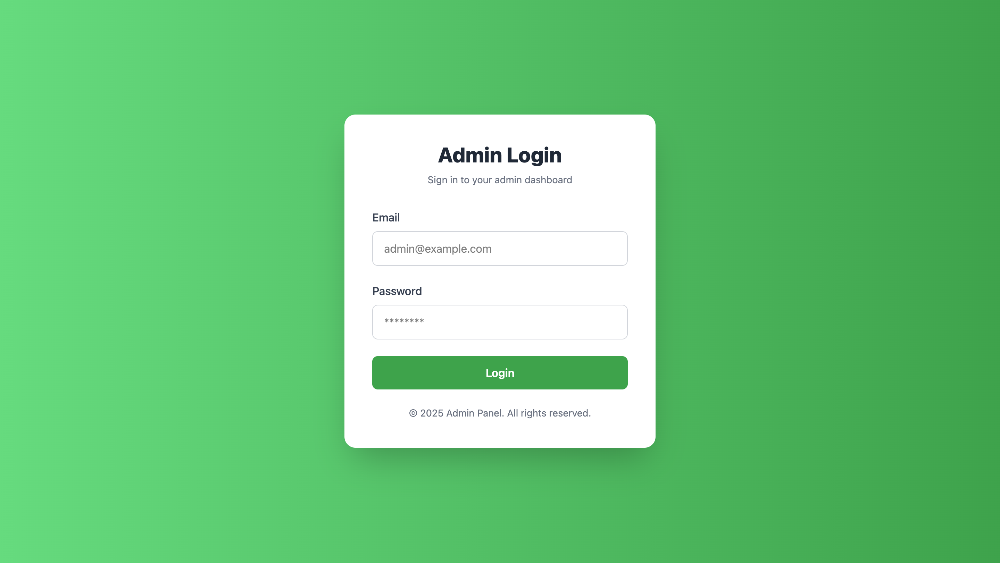
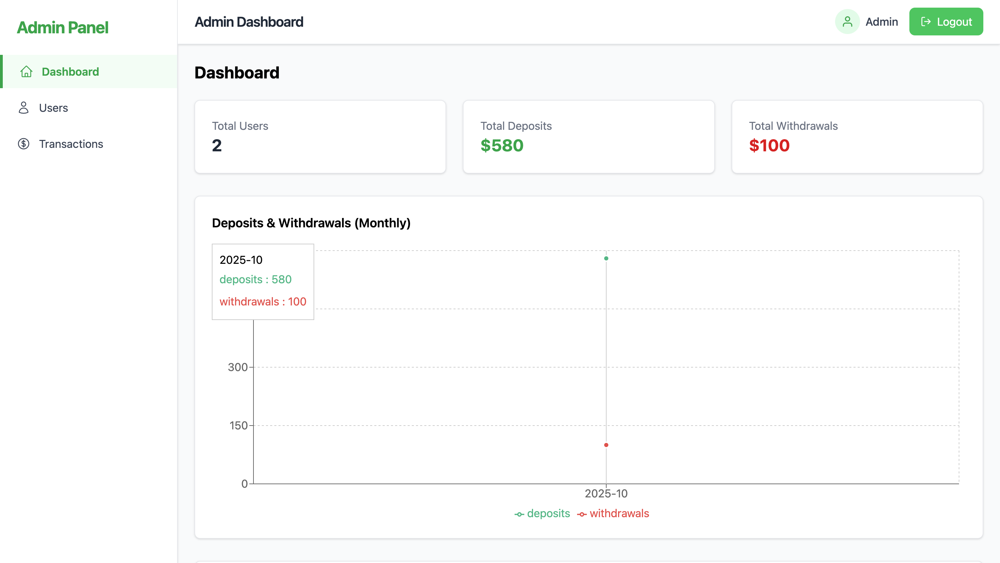
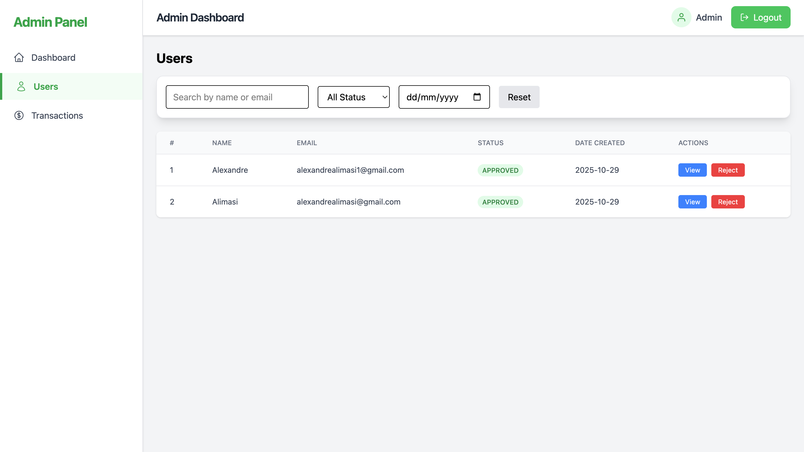
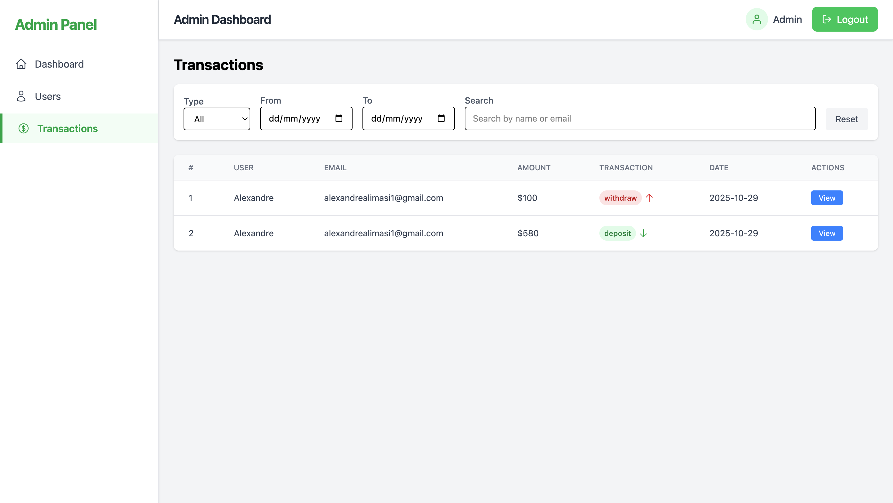

# **Credit Jambo Ltd – Admin Dashboard (Frontend)**

Admin Frontend for the **Savings Management System** at Credit Jambo Ltd.
This application allows administrators to manage customers, verify devices, monitor transactions, and view analytics through a modern, responsive dashboard.

---

## **Table of Contents**

* [Features](#features)
* [Tech Stack](#tech-stack)
* [Project Structure](#project-structure)
* [Installation](#installation)
* [Environment Variables](#environment-variables)
* [Usage](#usage)
* [Screenshots](#screenshots)
* [License](#license)

---

## **Features**

* **Admin Authentication** – Login with JWT-secured sessions
* **User Management** – View all users, search, filter by status and date
* **Device Verification** – Approve or reject customer devices
* **Transaction Monitoring** – View all transactions with detailed info
* **Dashboard** – See total users, total deposits/withdrawals, recent transactions, monthly statistics
* **Responsive UI** – Modern layout with TailwindCSS
* **Loader & Feedback** – Visual feedback for API calls and actions

---

## **Tech Stack**

* **Frontend:** React.js, Redux Toolkit, TailwindCSS
* **Charts & Analytics:** Recharts
* **State Management:** Redux Toolkit
* **Notifications:** react-toastify or custom toast utils
* **Routing:** React Router

---

## **Project Structure**

```
frontend/
├── src/
│   ├── components/   # Reusable UI components (Navbar, Sidebar, Tables, Panels)
│   ├── pages/        # Page views (Dashboard, Users, Transactions)
│   ├── services/     # API calls & admin service functions
│   ├── store/        # Redux slices for state management
│   └── utils/        # Helper functions, toast notifications
├── public/
├── package.json
└── README.md
```

---

## **Installation**

### Prerequisites

* Node.js >= 18
* npm or yarn

### Steps

```bash
# Clone the repository
git clone <repo-url>
cd frontend-admin

# Install dependencies
npm install
# or
yarn install

# Start development server
npm start
# or
yarn start
```

The app will run at [http://localhost:3000](http://localhost:3000).

---

## **Environment Variables**

Create a `.env` file in the root of your project:

```
REACT_APP_API_URL=http://localhost:5000
```

Replace the URL with your backend server URL.

---

## **Usage**

1. Open the admin dashboard in your browser.
2. Login with the admin credentials (from backend `.env` or database).
3. Navigate through **Dashboard**, **Users**, and **Transactions**.
4. Approve/reject customer devices and view monthly statistics.

---

## **Screenshots**

**Login Page**


**Dashboard Overview**


**User Management**


**Transactions Table**


---

## **License**

MIT License © 2025 Credit Jambo Ltd

---

# **Credit Jambo Ltd – Admin Backend**

Backend for **Savings Management System** providing APIs for authentication, user management, transactions, and statistics.

---

## **Table of Contents**

* [Features](#features)
* [Tech Stack](#tech-stack)
* [Project Structure](#project-structure)
* [Installation](#installation)
* [Environment Variables](#environment-variables)
* [Usage](#usage)
* [API Endpoints](#api-endpoints)
* [License](#license)

---

## **Features**

* **Admin Authentication** – JWT-secured login
* **User Management** – Fetch, approve, reject devices
* **Transactions** – Fetch all transactions, filter, and sort
* **Dashboard Stats** – Total users, total transactions, monthly statistics
* **Security** – Input validation, sanitized requests, secure HTTP headers

---

## **Tech Stack**

* **Backend:** Node.js, Express.js
* **Database:** MongoDB (Mongoose)
* **Authentication:** JWT, bcryptjs
* **Security:** Helmet, rate-limit
* **Utilities:** dotenv, body-parser

---

## **Project Structure**

```
backend/
├── src/
│   ├── controllers/   # Handle requests and responses
│   ├── services/      # Business logic
│   ├── models/        # Mongoose schemas
│   ├── dtos/          # Data Transfer Objects
│   ├── middlewares/   # Authentication, error handling
│   └── utils/         # Helpers
├── tests/             # Unit & integration tests
├── package.json
└── server.js          # Entry point
```

---

## **Installation**

### Prerequisites

* Node.js >= 18
* MongoDB running locally or in cloud

### Steps

```bash
# Clone the repository
git clone <repo-url>
cd backend

# Install dependencies
npm install
# or
yarn install

# Start development server
npm run dev
# or
node server.js
```

Server runs at [http://localhost:5000](http://localhost:5000).

---

## **Environment Variables**

Create a `.env` file in the root of your backend folder:

```
PORT=5000
MONGO_URI=mongodb://localhost:27017/creditjambo
JWT_SECRET=your_jwt_secret
ADMIN_EMAIL=admin@example.com
ADMIN_PASSWORD=your_admin_password
```

---

## **Usage**

* Start the backend server.
* Use **Postman** or your frontend to test endpoints.
* Admin can login, fetch users, approve/reject devices, and monitor transactions.

---

## **API Endpoints** (examples)

| Method | Endpoint            | Description                   |
| ------ | ------------------- | ----------------------------- |
| POST   | /admin/login        | Admin login                   |
| GET    | /admin/users        | Fetch all users               |
| PATCH  | /admin/users/verify | Approve/reject device         |
| GET    | /admin/transactions | Fetch all transactions        |
| GET    | /admin/dashboard    | Fetch summary & monthly stats |

---

## **License**

MIT License © 2025 Credit Jambo Ltd

